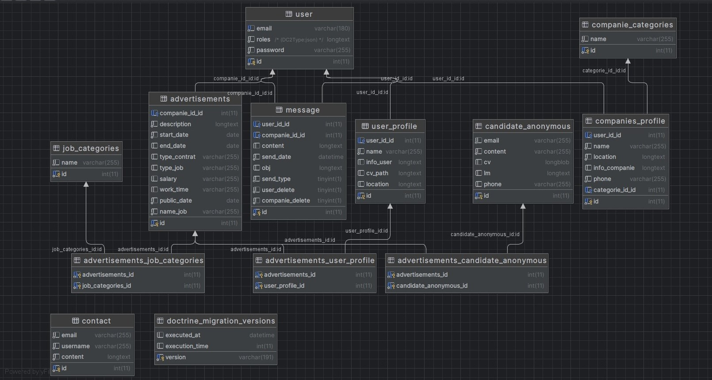

## Pôle Epitech

### Database 



### Technologie utilisée
#### **1. PHP 8.2.4 (Symfony 6.3.5)**
#### **2. Vue.js**
#### **3. Twig**
#### **4. JavaScript**
#### **4. SCSS**
#### **4. SQL (Vie à PhpMyAdmin)**

### About Symfony

##### Authentication 

###### **JWTAuthenticationBundle**
This bundle provides JWT (Json Web Token) authentication for your Symfony API.

It is compatible (and tested) with PHP 7.1+ on Symfony 4.x, 5.x and 6.x.
###### **Installation**

```
composer require "lexik/jwt-authentication-bundle"
```
##### **Generate the SSL keys**

```
php bin/console lexik:jwt:generate-keypair
```

##### **Configuration**
Configure the SSL keys path and passphrase in your .env:
```
JWT_SECRET_KEY=%kernel.project_dir%/config/jwt/private.pem
JWT_PUBLIC_KEY=%kernel.project_dir%/config/jwt/public.pem
JWT_PASSPHRASE=
```

```
# config/packages/lexik_jwt_authentication.yaml
lexik_jwt_authentication:
    secret_key: '%env(resolve:JWT_SECRET_KEY)%' # required for token creation
    public_key: '%env(resolve:JWT_PUBLIC_KEY)%' # required for token verification
    pass_phrase: '%env(JWT_PASSPHRASE)%' # required for token creation
    token_ttl: 3600 # in seconds, default is 3600
```

##### **Administration**

To manage the DB (only for admin user) with CRUD operations.

EasyAdmin

EasyAdmin creates beautiful administration backends for your Symfony applications. It's free, fast and fully documented.

###### **Installation**

```
composer require easycorp/easyadmin-bundle
```

###### **Dashboards**

```
php bin/console make:admin:dashboard
```
###### **CRUD Controllers**

```
php bin/console make:admin:crud "entity"
```

##### **WebpackEncoreBundle**
This bundle allows you to use the splitEntryChunks() feature from Webpack Encore by reading an entrypoints.json file and helping you render all of the dynamic script and link tags needed.
###### **Installation**

```
composer require symfony/webpack-encore-bundle
```

##### **Security**

Symfony provides many tools to secure your application. Some HTTP-related security tools, like secure session cookies and CSRF protection are provided by default. The SecurityBundle, which you will learn about in this guide, provides all authentication and authorization features needed to secure your application.

###### **Installation**

```
composer require symfony/security-bundle
```

##### **Doctrine ORM**

Symfony provides all the tools you need to use databases in your applications thanks to Doctrine, the best set of PHP libraries to work with databases. These tools support relational databases like MySQL and PostgreSQL and also NoSQL databases like MongoDB.

###### **Installation**

```
composer require symfony/orm-pack
composer require --dev symfony/maker-bundle
```

###### **Configuring the Database**

```
# .env (or override DATABASE_URL in .env.local to avoid committing your changes)
# to use mariadb:
DATABASE_URL="mysql://root:@127.0.0.1:3306/jobboard?serverVersion=10.11.2-MariaDB&charset=utf8mb4"
```

###### **Migrations: Creating the Database Tables/Schema**

```
php bin/console make:migration
php bin/console doctrine:migrations:migrate
```

##### **TwigBundle**

TwigBundle provides a tight integration of Twig into the Symfony full-stack framework.

###### **Installation**

```
composer require symfony/twig-bundle
```

### About Vue3

##### **Symfony UX Vue.js**

Symfony UX Vue.js is a Symfony bundle integrating Vue.js in Symfony applications. It is part of the Symfony UX initiative.

Vue.js is a JavaScript framework for building user interfaces. Symfony UX Vue.js provides tools to render Vue components from Twig, handling rendering and data transfers.

Symfony UX Vue.js supports Vue.js v3 only.

###### **Installation**

```
composer require symfony/ux-vue
```
###### **Install a package to help Vue:**

```
npm install -D vue-loader --force
npm run watch
```

###### **Usage:**

```
// assets/app.js
import { registerVueControllerComponents } from '@symfony/ux-vue';

registerVueControllerComponents(require.context('./vue/controllers', true, /\.vue$/));
```


### About Test Tools

###### 1.PostMan -> test Api
###### 2.Debug-Bundle -> symfony
###### 3.Vue.js devtools (Chrome) -> Vue.js

### Notice:

#### PHP.ini
```
extension=curl
extension=intl
extension=pdo_mysql
extension=zip
extension=sodium
```

#### my.ini
```
# Used to upload CV to the database
max_allowed_packet=16M
innodb_lock_wait_timeout=28800
```